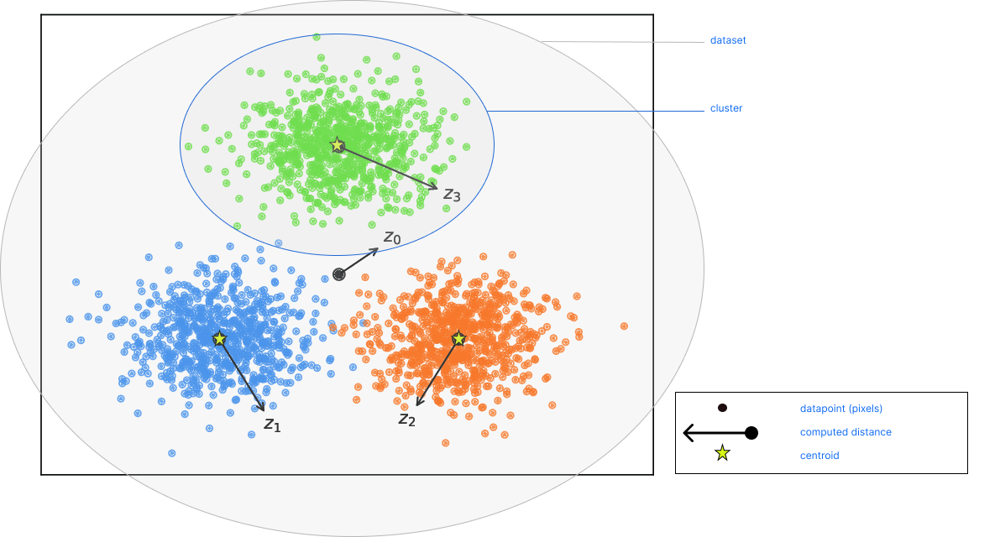
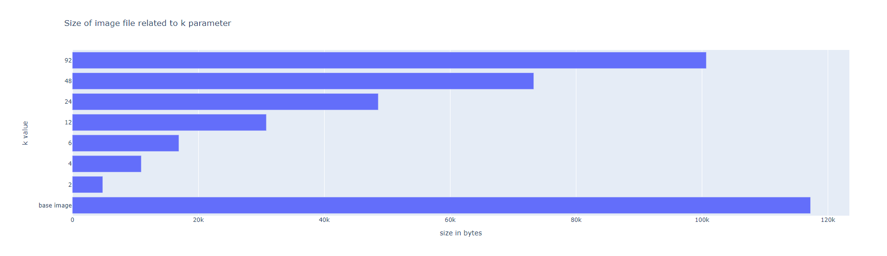
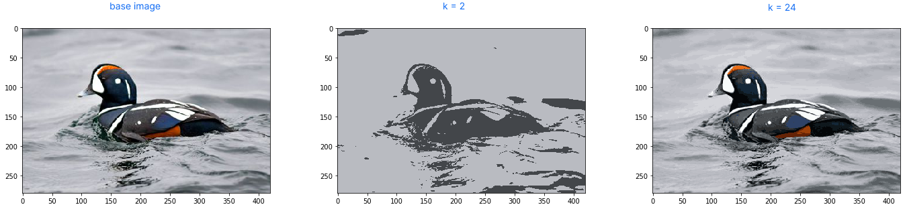

#  Image compression

In our projet we are looking for a quick, flexible and efficient method to reduce the size of image data.
We decided to chose a clustering algorithm called **Kmean**.
It is used in several fields such as machine learning, business market segmentation or image compression.
It works by clustering datapoints of a given dataset(customers in database, pixels of an image...) into "k" number of clusters.

###   How does it works more precisely ?

-  First, we have to define the number of k cluster we want to find in our image. These represents colors in a dimensional space in our case.  
-  Then, since we don't have similar patterns of colors, we randomly place centroids.  
-  For each pixel we'll find the nearest centroid by computing Euclidian distance and assign that pixel to this centroid.  
-  Next step is recalculating centroid position by average each data data assigned to this cluster. This operation is done until convergence, when none of the centroids position change.

###  Why does it fits our goal ?

This can algorithm is flexible, we can adapt the k parameter value in order to find balance between performance, speed and efficiency.  
Also it is widely used and implemented in libraries such as sklearn.

###  efficiency visualisation

As we said earlier, efficiency rely on the numbers of cluster and the shape of our data.
We can notice the following:
* 2 clusters leads to huge size reduction but we loose too much information
* 24 clusters leads to very good performance and keeps fairly good quality for a 280 * 420 image.

